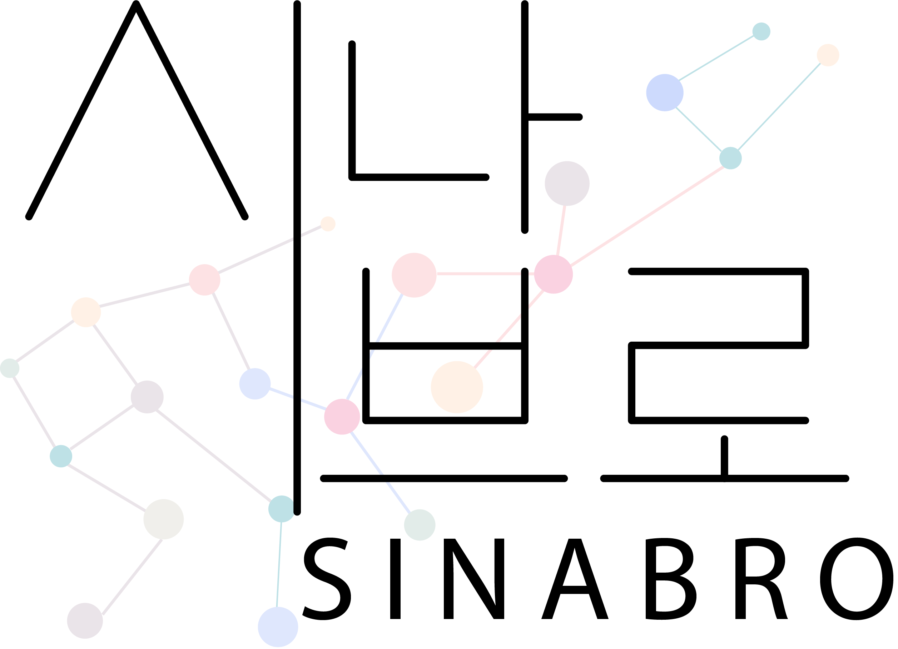

# Sinabro - Sequential Mutations Simulator
**Sinabro** (Korean: 시나브로) means "little by little unknowingly." The program will mutate a given coding sequence one-by-one until it mets given condition, and generates a sequence of sequences which I'll call a *trajectory*.



## How to use
Import Sinabro as:
```python
import sinabro as snbr
```

Initialize trajectory: you need to provide id (`str`) and data (`str`, `Seq`, or `MutableSeq`)
```python
seq = "TATGCTGACTCGGTCATCGATCGGTTCTCATTGAT"
traj = snbr.Trajectory(id="Test", data=seq)
```

Display trajectory:
```python
traj.show()
```
```console
ID: test
Trajectory length: 0

Sequence                              HGVS_mRNA   HGVS_Protein   Mutation_Type   Note
TATGCTGACTCGGTCATCGATCGGTTCTCATTGAT   .           .              .               .
```

Generate trajectory: you can generate trajectory automatically by giving a condition (`max_length` or `nonsynonymous`) and a method (`random`, `mut_type`, or `signature`)
```python
# 
seq = "TATGCTGACTCGGTCATCGATCGGTTCTCATTGAT"
traj = snbr.Trajectory(id="Test", data=seq)
traj.autofill(condition="max_length", method="random")

traj.show()


# 
seq = "TATGCTGACTCGGTCATCGATCGGTTCTCATTGAT"
traj = snbr.Trajectory(id="Test", data=seq)
traj.autofill(condition="max_length", method="mut_type", mut_type="T[C>T]")

# 
seq = "TATGCTGACTCGGTCATCGATCGGTTCTCATTGAT"
traj = snbr.Trajectory(id="Test", data=seq)
traj.autofill(condition="max_length", method="signature", mutational_signature="SBS2")

# 
seq = "TATGCTGACTCGGTCATCGATCGGTTCTCATTGAT"
traj = snbr.Trajectory(id="Test", data=seq)
traj.autofill(condition="nonsynonymous", method="random")

# 
seq = "TATGCTGACTCGGTCATCGATCGGTTCTCATTGAT"
traj = snbr.Trajectory(id="Test", data=seq)
traj.autofill(condition="nonsynonymous", method="mut_type", mut_type="T[C>T]")

# 
seq = "TATGCTGACTCGGTCATCGATCGGTTCTCATTGAT"
traj = snbr.Trajectory(id="Test", data=seq)
traj.autofill(condition="nonsynonymous", method="signature", mutational_signature="SBS2")
```